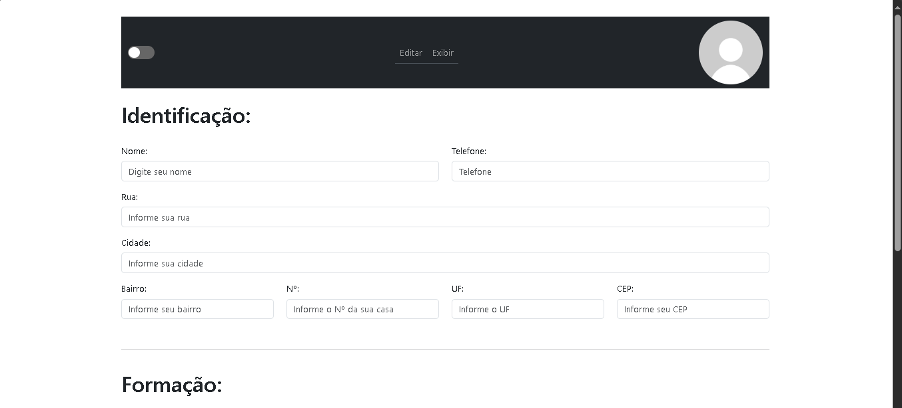
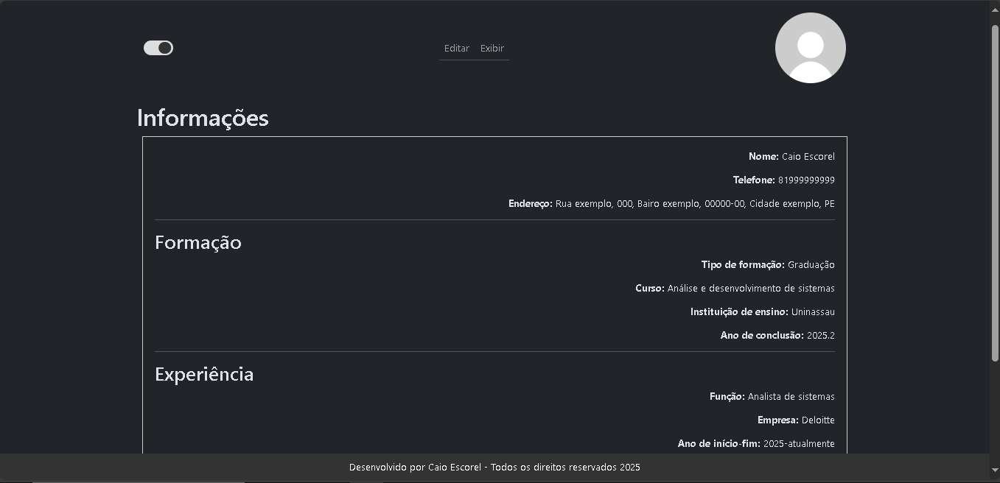

# 📝 Gerador de Currículos

Este repositório contém um gerador de currículos desenvolvido como projeto final do treinamento **Do Zero ao Full Stack** da Treina Recife. O sistema consiste em um **frontend** desenvolvido em **React** e um **backend** utilizando **Spring Boot** e **MySQL**.

---

## 📌 Tecnologias Utilizadas

- **Frontend:** React, React Bootstrap, Axios, React Router, jsPDF, html2canvas
- **Backend:** Spring Boot, Java, Maven
- **Banco de Dados:** MySQL

---

# 🚀 Como Executar o Projeto

## 📂 Spring API (pasta `springApi`)

A API desenvolvida em **Spring Boot** é responsável por fornecer os serviços para a geração de currículos e gerenciar as informações do usuário.

### ✅ 1. Pré-requisitos

- **Java 17** ou superior - [Baixar](https://www.oracle.com/java/technologies/javase/jdk17-archive-downloads.html)
- **Maven** instalado - [Baixar](https://maven.apache.org/download.cgi)
- **MySQL** instalado e rodando - [Baixar](https://dev.mysql.com/downloads/installer/)

### 📥 2. Como baixar o projeto

```sh
# Clonar o repositório
git clone https://github.com/Caioesc/projetoTreina.git

# Acessar a pasta do backend
cd projetoTreina/springApi
```

### ▶️ 3. Como rodar o backend

1. Configure o banco de dados MySQL e atualize o `application.properties` com suas credenciais.
2. No terminal, dentro da pasta `springApi`, execute:

```sh
./mvnw spring-boot:run
```

O backend estará rodando em **[http://localhost:8080](http://localhost:8080)**.

---

## 🎨 Frontend (pasta `frontend`)

O frontend foi desenvolvido utilizando **React** e permite que os usuários preencham seus dados para gerar currículos personalizados.

### 🖼️ Captura de Tela

| Telas |
| ------|
| |
| |


### ✅ 1. Pré-requisitos

- **Node.js** instalado (versão 16 ou superior) - [Baixar](https://nodejs.org/)
- **Gerenciador de pacotes npm**

### 📥 2. Como baixar o projeto

```sh
# Clonar o repositório
git clone https://github.com/Caioesc/projetoTreina.git

# Acessar a pasta do frontend
cd projetoTreina/frontend
```

### ▶️ 3. Como rodar o frontend

1. Instale as dependências do projeto:

```sh
npm install
npm install react-bootstrap bootstrap
npm install axios
npm install react-router-dom
npm install jspdf html2canvas
```

2. Execute o projeto:

```sh
npm run dev
```

O frontend estará rodando em **[http://localhost:5173](http://localhost:5173)**.

---

## 📜 Licença

Este projeto está licenciado sob a **Creative Commons Legal Code**.

## 📬 Contato

Caso queira entrar em contato, me mande um e-mail ou me adicione no LinkedIn:

📧 **[caioheraclio@gmail.com](mailto:caioheraclio@gmail.com)**\
🔗 **[LinkedIn](https://www.linkedin.com/in/caioescorel/)**

Se este projeto foi útil para você, dê uma ⭐ no repositório! 😃
